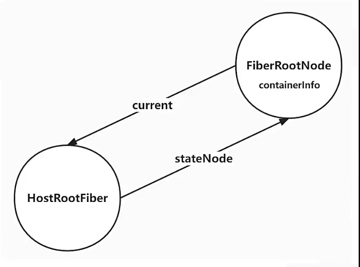
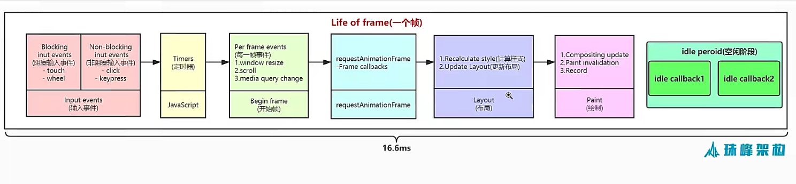
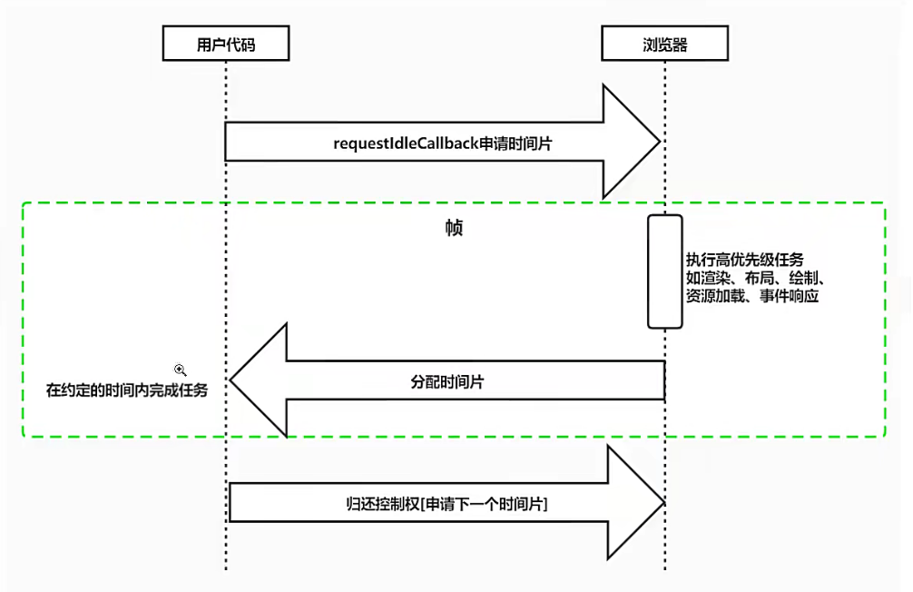
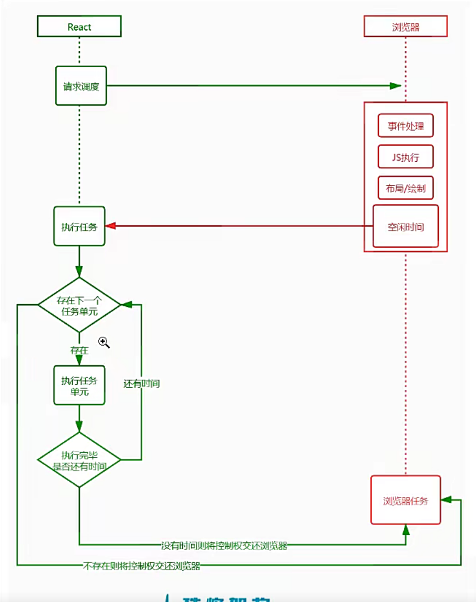
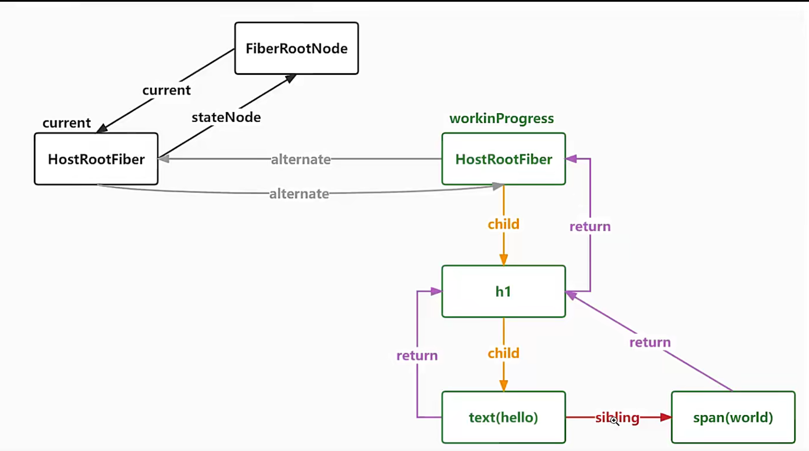
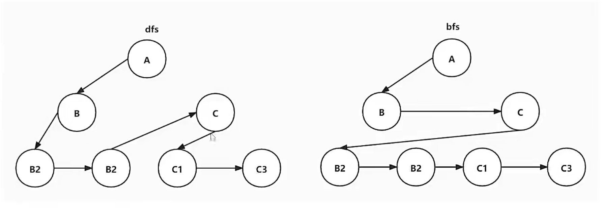
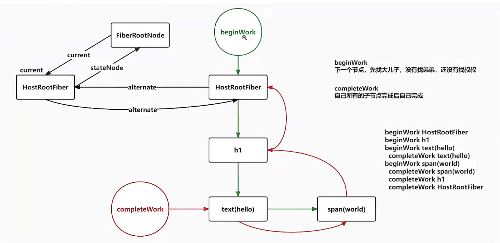
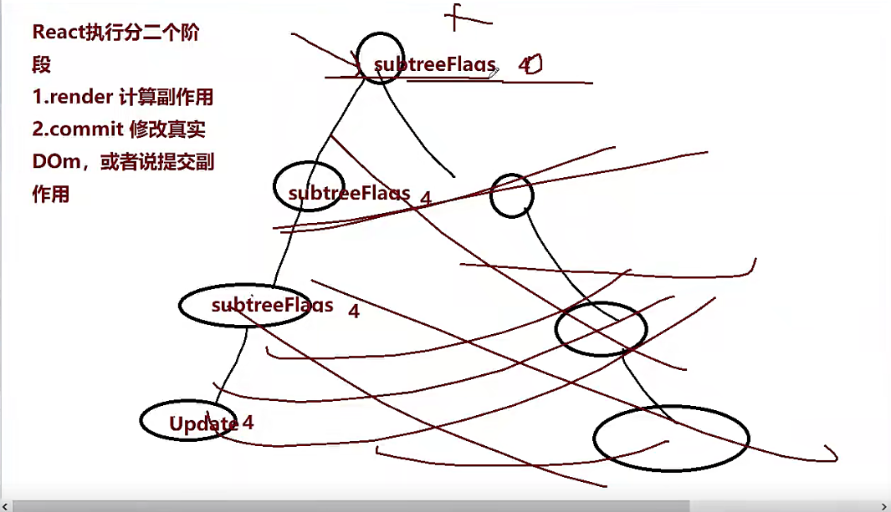
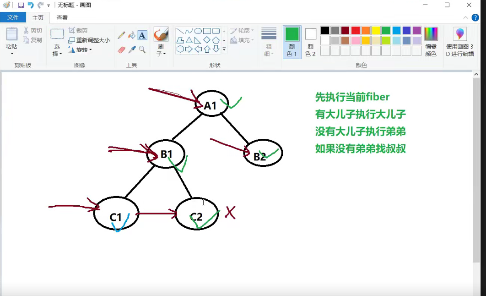
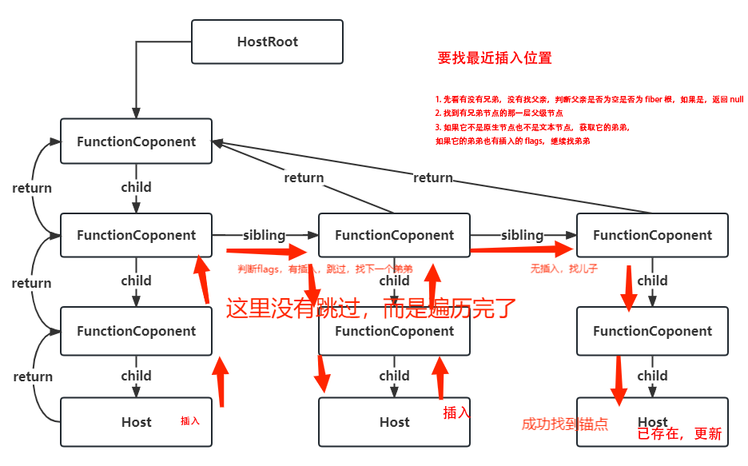

[//]: # ([//]C:\BaiduNetdiskDownload\23年9月珠峰\资料\00  课件资料\3708\react20220925-master\react20220925-master)

[//]: # (http://www.zhufengpeixun.com/strong/html/96.2.fiber.html)
[//]: # (http://www.zhufengpeixun.com/strong/html/157.1.react18.html)
# FiberRootNode
FiberRootNode=containerInfo,就是一个真实的根节点dom容器

## fiber
- 性能瓶颈

JS任务执行时间过长。浏览器刷新频率为 60Hz,大概 16.6 毫秒染一次，而JS 线程和染线程是互斥的，所以如果 JS 线程执行任务时间超过 16.6ms 的话，
就会导致掉，导致卡顿，解决方案就是 React 利用空闲的时间进行更新，不影响渲染进行的渲染
把一个耗时任务切分成一个个小任务，分布在每一段时间的方式就叫时间切片
- 屏幕刷新率

目前大多数设备的屏幕刷新率为 60次/秒。浏览器渲染动画或页面的每一帧的速率也需要跟设备屏幕的刷新率保持一致
页面是一帧一帧绘制出来的，当每秒绘制的帧数(FPS)达到 60 时，页面是流畅的,小于这个值时，用户会感觉到卡所
每个的预算时间是 16.66 毫秒(1秒/60)。1s 60帧，所以每一分到的时间是 1000/60 6 ms,所以我们书写代码时力求不让一的工作量超过 16ms

- requestIdleCallback

我们希望快速响应用户，让用户觉得够快，不能阻塞用户的的交互使开发者能够在主事件循环上执行后台和低优先级工作，而不会影响延迟关键事件，
如动画requestIdleCallback和输入响应正常帧任务完成后没超过 16 ms,说明时间有富余，此时就会执行requestIdleCallback 里注册的任务
requestIdleCallback 会在浏览器空闲时执行，如果浏览器一直忙，那么这个任务就会一直等待，直到浏览器空闲为止

- react并没有使用requestIdleCallback
1. requestIdleCallback 有兼容性问题
2. requestIdleCallback 有一个优先级的概念，但是这个优先级是由浏览器决定的，react希望能够自己控制优先级
3. requestIdleCallback 不能暂停任务，如果一个任务已经开始执行了，那么就不能中断，react希望能够暂停任务
4. requestIdleCallback 不能保证回调函数的执行时间，react希望能够知道回调函数的执行时间，能够得到执行时间的反馈
5. requestIdleCallback 回调函数的第一个参数是一个 IdleDeadline 对象，这个对象有一个 timeRemaining 方法，可以得到当前帧还剩余多少时间，
但是这个时间是一个预估值，react 希望得到的是一个精确值
6. requestIdleCallback 不能处理高优先级的任务，比如用户的点击事件，react 希望能够处理高优先级的任务
7. requestIdleCallback 不能保证每一帧都会执行，react 希望每一帧都有任务执行

react自己实现了一个调度器，这个调度器的核心思想就是利用空闲时间执行任务，这个调度器的名字叫做Fiber

这种调度方式是合作式调度，因为任务的执行权是由调度器来分配的，而不是由浏览器来分配的，所以叫做合作式调度

通过Fiber架构让调和过程可以被打断，这样就可以把渲染工作分解到多个帧中完成，从而实现了时间切片。

- Fiber是一个执行单元

每次执行完一个Fiber，就会检查当前是否有剩余时间，如果有的话，就会执行下一个Fiber，如果没有的话，就会把执行权交还给浏览器，
让浏览器执行一会儿，然后再继续执行下一个Fiber

- Fiber是一种数据结构

fiber是一个对象，这个对象对应着组件的一个实例，这个对象里面保存着这个组件的类型，对应的DOM节点，还有子节点，兄弟节点等信息

说明
hostRootFiber:根节点的Fiber对象
workInProgressFiber:当前正在工作的Fiber对象

当前fiber的child指向第一个子节点，
sibling指向本节点的兄弟节点，return是在子节点上，并指向父节点

## 构建fiber树与树的遍历

- 树的遍历
bfs（深度优先遍历）和dfs（广度优先遍历）

深度优先遍历是对每一个可能的分支路径深入到不能再深入位置，而且每一个节点只能访问一次，应用场景。
react的虚拟dom构建和react的fiber构建
广度优先遍历是

## fiber构建过程，有递有归

[fiber执行的顺序](./demo/fiberSequence.js)

## 找插入锚点

### diff对比

DOM DIFF 的三个规则
只对同级元素进行比较，不同层级不对比
不同的类型对应不同的元素
可以通过 key 来标识同一个节点
第 1 轮遍历
如果 key 不同则直接结束本轮循环
newChildren 或 oldFiber 遍历完，结束本轮循环
key 相同而 type 不同，标记老的 oldFiber 为删除，继续循环
key 相同而 type 也相同，则可以复用老节 oldFiber 节点，继续循环
第 2 轮遍历
newChildren 遍历完而 oldFiber 还有，遍历剩下所有的 oldFiber 标记为删除，DIFF 结束
oldFiber 遍历完了，而 newChildren 还有，将剩下的 newChildren 标记为插入，DIFF 结束
newChildren 和 oldFiber 都同时遍历完成，diff 结束
newChildren 和 oldFiber 都没有完成，则进行节点移动的逻辑
第 3 轮遍历
处理节点移动的情况

## 优先级队列算法，最小堆

